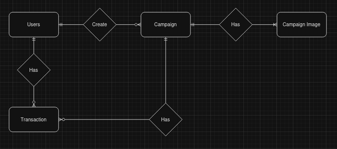

# CrowdFunding-Golang-NuxtJS
## Summary:
Golang has good performance, as a default golang is secure from RCE upload file, XSS using TEXT/HTML package.

This repository has purposes:
- Learning how to build website
- Learning the algorithm mechanism of the website
- Learning how to code review and secure our code from malicious attackers.

### Technologies
Database: postgresql
Backend: Golang
ORM: Gorm
Auth: JWT

## Documentation
### Entity Relationship Diagram
<a href="https://drive.google.com/file/d/17UWkw1TEQ6WGlj367Ysj8Pdl2TFtt30D/view?usp=sharing">click here!</a>

### Database Diagram

<a href ="https://dbdiagram.io/d/CrowdFunding-66e85cb56dde7f4149453df2"> Click here!</a>

